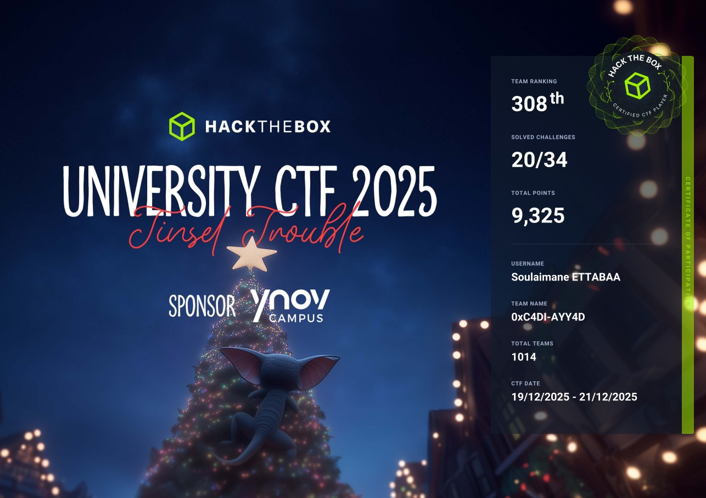

 About the Event
🎄 Grand Legend — The Tinsel Trouble of Tinselwick

In the snow-glittered village of Tinselwick, where peppermint chimneys puff cinnamon steam and toy trains zip between rooftops, the Festival of Everlight is the most magical night of the year. It’s when the Great Snowglobe atop Sprucetop Tower shines brightest, sending cheer across the land and granting every child one heartfelt wish.

But this year… something’s gone adorably wrong.

The Snowglobe’s glow has flickered. The Wish-Wires have tangled. The Nutcracker Choir is singing in reverse. And strangest of all, a mischievous force known only as The Gingerbit Gremlin has stolen the Starshard Bauble, the ornament that powers the whole Festival!

With the countdown to Everlight Eve ticking fast, eight unlikely helpers—toy-fixers, cocoa-brewers, misfit scouts, and jolly engineers—must rally their sleighs, tighten their scarves, and follow peppermint-crumb trails through snowdrift mazes, puzzle cottages, and gingerbread vaults to recover the stolen magic.

This isn’t a battle to save the world—it’s a dash to save the spirit of the season.

The Great Snowglobe must sparkle again. And in Tinselwick, even the tiniest heart can outshine the longest night.

**<write up coming soon !>**
